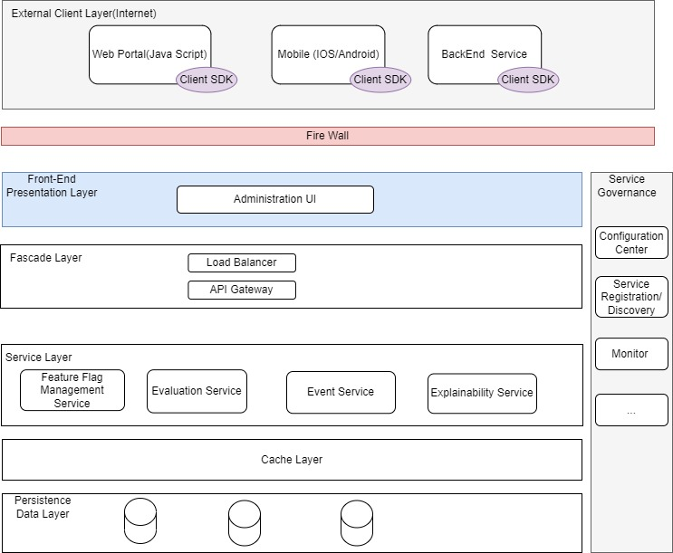
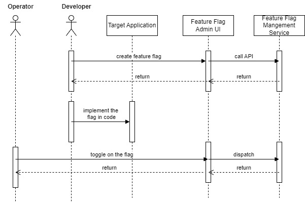
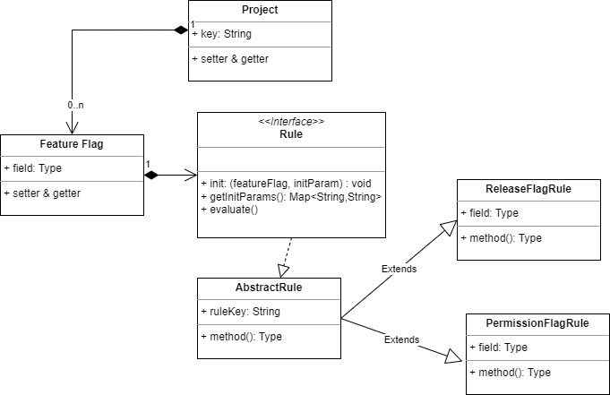
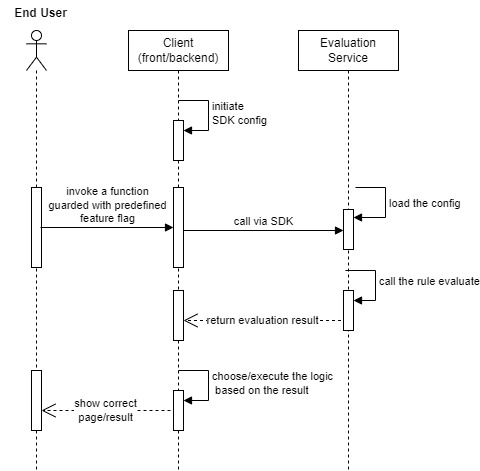
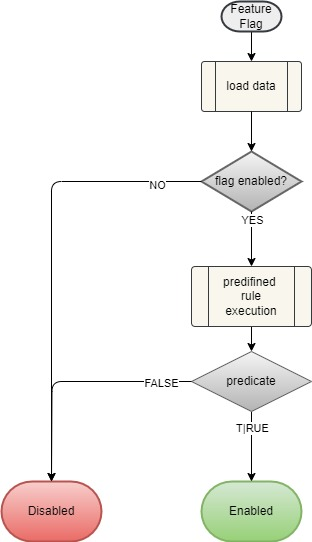
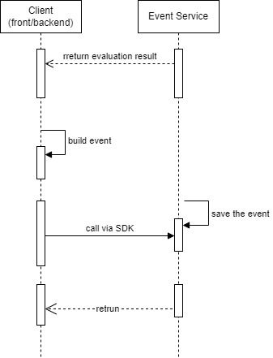
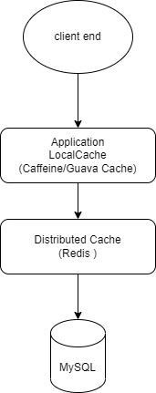
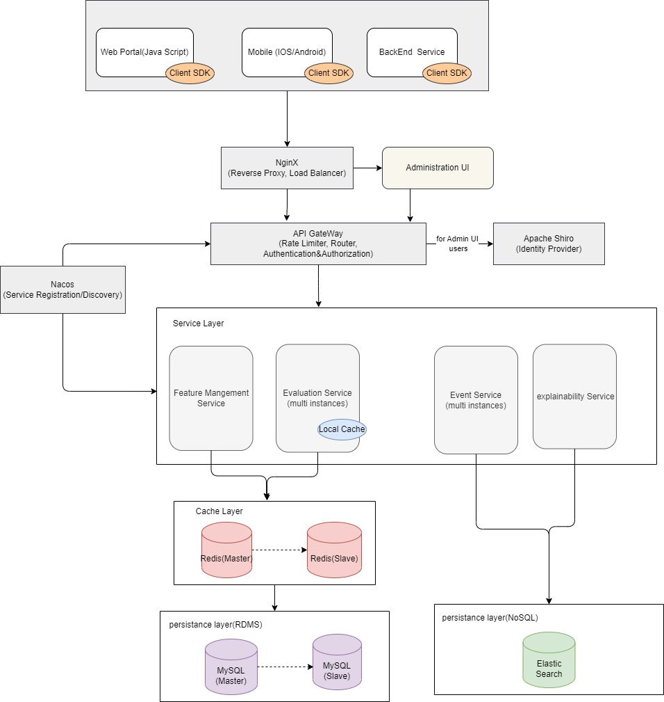
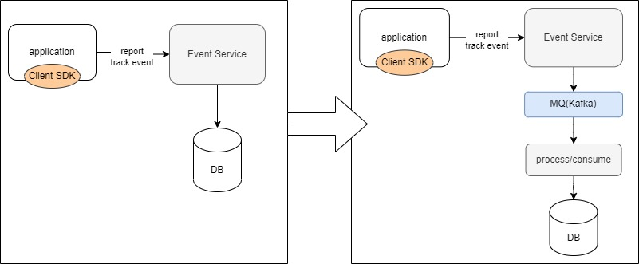

# Feature Management Solution Architecture 

## 1. Introduction

### 1.1 Document Purpose  
This document serves as the authoritative blueprint for **Feature Management Service**, detailing the architectural design, component interactions, and technical specifications required to deliver the system. It ensures alignment across cross-functional teams, including developers, testers, product managers, and operations, and provides a reference for maintenance and future enhancements.

### 1.2 Audience  
- Technical leads and system architects  
- Frontend, backend, and full-stack engineers  
- QA engineers and DevOps specialists  
- Product managers and business stakeholders  

### 1.3 Scope  
Covers high-level architecture, subsystem design, data models, interface specifications, performance strategies. Excludes code-level implementation details, project timelines, and budget breakdowns.

### 1.4 References  
- *Align_Expert_Software_Engineer_R2_Quiz.md*  
- [*Feature Toggles (aka Feature Flags)*](https://martinfowler.com/articles/feature-toggles.html)

### 1.5 Terms and Abbreviations  

| Term/Abbreviation | Full Form | Definition |
|-------------------|---------|-----------|
| SDD | System Design Document | The current document |
| API | Application Programming Interface | A set of rules for software component interaction |
| Feature Flag | Feature Flag | A toggle which can be configured and used to modify the system behavior without change the code |

## 2. System Overview & Requirements

### 2.1 System Context  
The e-commerce platform has more than 100 applications/services, and each has it's own deployment flow for the new features(more than 1000 features) deployment/online/offline. In order to improve the new feature continuous deployment more efficiency and effective , a centralized feature management service is needed , and this solution describe and illustrate how the system designed .

### 2.2 Functional Requirements(FR)  

#### 2.2.1 Feature flag Management

- support the creation, modification, delete of each feature flag
- support to enable/disable an existing feature flag
- support to creation, modification, delete of the application rule/strategy for the feature flag

#### 2.2.2 Flag evaluation service

- provide real-time flag evaluation for the client , and return the result ,  enabled/disabled 
- Support context-based evaluation: user ID, device type, region, environment, release and so on.
- Support consistent evaluation results across web, backend APIs, mobile clients.

#### 2.2.3 Client SDK capabilities

- SDK provides lightweight SDK for multiple clients : backend(Java/Go/Python), web portal( java script) and mobile( iOS/Android)
- SDK supports connecting to the feature flag evaluation service , and can do real-time evaluation of flag
- SDK provides unified simple integration interface , so that it can easily integrate and works consistently across different client types

#### 2.2.4  API exposed 

- Management API: CRUD for the feature flag , properties, and relevant entities
- Evaluation API :   evaluate the input flag based on the provided parameters according to the predefined rule/strategy , and return the evaluation result, which must at least include the enabled/disabled result.
- Sync API:  used for SDK get the feature flag configurations from the feature management server
- Audit API: record the flag changes, evaluations and rule/strategy hit

#### 2.2.5  Explainability  capability

- for any evaluation flag, the system can record the event including :  
  - Whether the flag is enabled
  - target user/role
  - region/environment
  - corresponding release 
- support the query for the above trace/log

#### 2.2.6 Observability data collection

- Collect flag evaluation metrics: QPS, hit rate, error rate, latency
- Collect flag change event and rule matching events
- support logging of evaluation context and decision reasons

### 2.3 Non-Functional Requirements (NFR) 

#### 2.3.1 Performance
-  **High throughput**: Support massive concurrent flag evaluations across 100+ services. 
-  **Low latency**: Sub-millisecond or single-digit millisecond latency for evaluation. 
-  Stable performance even as the number of feature flags scales to thousands. 

#### 2.3.2  Scalability 
- System can scale out linearly with increasing feature flags, applications and evaluation traffic
-  Support horizontal scaling of service instances  

#### 2.3.3 Cache efficiency(Caching Strategy )
-  Multi-level caching (in-memory, distributed cache) must be cost-effective and efficient. 
- Cache must support high hit rate and low memory footprint. 
- Cache consistency:  as per the system characteristics,   volume of the feature flag modification is much lesser than the read of relevant information, so there's not too much need that once the flag updated it can be reflected in the system simultaneously , but can be effective after couple of seconds. so eventually consistency could be a acceptable solution.

#### 2.3.4  Consistency 

- Consistent flag behavior across web, backend, mobile clients under same context. 
-  As per the system characteristics,   volume of the feature flag modification is much lesser than the read of relevant information, so there's not too much need that once the flag updated it can be reflected in the system simultaneously , but can be effective after couple of seconds. so eventually consistency could be a acceptable solution.

#### 2.3.5 

## 3. High-Level Architecture Design

### 3.1 Architectural Principles  
- **Domain-Driven Design (DDD)**: Align service boundaries with business domains to reduce coupling.  
- **Event-Driven Communication**: Use Apache Kafka for asynchronous data flow between microservices.  
- **API-First Development**: Design RESTful APIs before implementing frontend or backend components.  
- **Defense in Depth**: Layered security measures across network, application, and data levels.

### 3.2 Architecture Diagram  

- Logical Module Architecture from functional perspective

  


> ![(Feature Management Service Solution Architecture.assets/System Architecture-1775552064112.jpg) 

### 3.3 Component Layers  
- **Client Layer**:  The clients which will connect to the Feature Management server /APIs, it could be web portal, mobile APP, backend services.

- **Load Balancer** : NginX it works as a reverse proxy load balancer 

- **API Gateway**: Centralized entry point for routing requests, authentication, rate limiting, and load balancing ( Spring Cloud Gateway).  

- **Service Layer**: Independent, deployable services focused on single business capabilities (Feature Management service, Evaluation service, event service).  

- **Cache Layer**:  distributed cache , Redis adopted

- **Persistence Storage Layer**:  persistent data storage , it could be relational DB(MySQL) or NoSQL DB

  

### 3.4 Technology Stack  

| Category | Technology | Rationale |
|--------|------------|----------|
| Backend Framework | Spring Boot | Mature ecosystem, cloud-native support, and built-in tools for security and monitoring. |
| Relational Database | MySQL | Strong ACID compliance, JSON support, and extensibility for complex queries. |
| NoSQL Database | Elastic Search | used to store the log/event data |
| Cache | Redis | Sub-millisecond response times, pub/sub capabilities, and support for data structures like sorted sets. |
| Messaging | Apache Kafka | Durable, scalable event streaming with high throughput and fault tolerance. |
| Monitoring | Prometheus + Grafana | Real-time metrics collection and customizable dashboards for performance tracking. |

## 4. Core Subsystem Design

### 4.1 Feature Flag Management Service

#### 4.1.1 Responsibilities  
Manage the feature related information, including project, feature flag, rule definition and so on, provide the APIs to create, update, delete the relevant information. 

#### 4.1.2 Internal Design  
- **Core Components**:  
  
  - Feature Flag Management Server:  exposed APIs to create/update/delete the feature flag relevant information.
  - Administration UI:  A front-end system provides the UI to the end user(developer, operation team, product owner, and so on), it will connect to the backend Feature Flag Management Server.
  
- **Key Workflow (Sequence Diagram)**:  
  
  1. Developer create the needed feature flag via Administration UI
  
  2. Developer implement the feature flag and relevant logic with code in the target application
  
  3. Operator/Developer/Product owner toggle on the flag via Administration UI and publish it
  
  4.  The flag take effect after all the system/environment started up properly
  
       
  
- **Data Model**: The following lists the major data tables for this component 

**Control Fields** : the following controlled fields will be used for many tables, so list separately here to avoid duplication description.

| Field        | Type        | Description                       |
| ------------ | ----------- | --------------------------------- |
| created_time | DATETIME    | UTC timestamp when record created |
| created_by   | VARCHAR(32) | User Id who created this record   |
| updated_time | DATETIME    | UTC timestamp when record updated |
| updated_by   | VARCHAR(32) | User Id who updated this record   |

**Table: `access_token`**  : define the project/application access token used to connect to the Feature Management System

| Field          | Type         | Description                                                  |
| -------------- | ------------ | ------------------------------------------------------------ |
| id             | BIGINT       | Primary key (auto-incrementing)                              |
| token          | VARCHAR(256) | **Unique** key for the project                               |
| client_id      | VARCHAR(256) | the client id who owns the token                             |
| expire_time    | DATETIME     | expire time of the token                                     |
| description    | VARCHAR(256) | brief description for the project                            |
| status         | TINYINT      | indicate the data record status, such as : disabled, deleted, etc. |
| control fields |              |                                                              |

**Table: `project`**  : define the project/application which will adopt the Feature Flag System

| Field | Type | Description |
|------|------|-------------|
| id | BIGINT | Primary key (auto-incrementing) |
| key | VARCHAR(128) | **Unique** key for the project |
| name | VARCHAR(128) | name of the project |
| description | VARCHAR(256) | brief description for the project |
| status | TINYINT      | indicate the data record status, such as : disabled, deleted, etc. |
| control fields |              |                                                              |

**Table: `feature_flag`**  : define the feature log basic information, and relevant rule

*Note:  As the initial design I put the rule information in the same table as JSON, just to indicate the logic how it works, it could be separate tables in final implementation .*

| Field | Type | Description |
|------|------|-------------|
| id | BIGINT | Primary key(auto-incrementing) |
| key            | VARCHAR(128) | **Unique** key for the feature flag                          |
| description    | VARCHAR(256) | brief description for the feature flag                       |
| project_key    | VARCHAR(128) | **Unique** key for the project                               |
| env_type       | VARCHAR(64)  | environment type where the feature flag will be applied, enumeration value: production, UAT, ST... |
| enabled        | TINYINT      | 1: enabled 0: disabled                                       |
| flag_category  | VARCHAR(64)  | valid value: release flag,experiment flag, ops flag,permission flag |
| status         | TINYINT      | indicate the status of the feature flag in it's lifecycle, 0: created , 1: implemented, 2: published , 3: cleanup |
| rule_type | VARCHAR(128) | the rule type which will be used to do the evaluation |
| rule_details | TEXT | JSON format rule/strategy details |
| control fields |              |                                                              |

**Table: `audit_log`**  : any change of the entity will be logged in the table

| Field        | Type         | Description                                                  |
| ------------ | ------------ | ------------------------------------------------------------ |
| id           | BIGINT       | Primary key (auto-incrementing)                              |
| operator     | VARCHAR(128) | User ID of the operator                                      |
| operate_type | VARCHAR(128) | name of the project                                          |
| description  | VARCHAR(256) | brief description for the project                            |
| target_type  | VARCHAR(128) | the type of the target being changed, project, feature flag... |
| target_key   | VARCHAR(128) | Unique key of the target                                     |
| old_value    | TEXT         | the old value before change                                  |
| new_value    | TEXT         | new value after change                                       |
| create_time  | DATETIME     |                                                              |

#### 4.1.3 Class Diagram

​	The following is the basic class diagram for this part(not completed diagram, but just list main part)



#### 4.1.3 Interface Design  

​	 all of the exposed API has a unified response class like: 

```java
public class ResponseData<T> {
    private String code;
    private String message;
    private T data;

    public static <E> ResponseData<E> success(E data) {
        return new ResponseData<>("0", "Success", data);
    }
}
```

- **Exposed APIs**:  
  
  1.  Access Token APIs
  
     1) POST /api/v1/access-token: Create a new access token.  
  
     Request Body:  JSON corresponding to the access token object
  
     2) GET /api/v1/access-token/{clientID}
  
     ​	query the access token for the corresponding client
  
  ​		3) PUT  /api/v1/access-token/{clientID}
  
  ​			update the fields of the token object
  
  ​			Request Body: JSON corresponding to the access token object
  
  2.  Project APIs
  
      	1) POST /api/v1/project: Create a new access token.  
  
     ​		Request Body:  JSON corresponding to the access token object
  
     ​		2) GET /api/v1/project/{projectKey}
  
     ​			query the project with the provided project key
  
     ​		3) PUT  /api/v1/project/{projectKey}
  
     ​			update the fields of the project with provided project key
  
     ​			Request Body: JSON corresponding to the project
  
  3.  Feature Flag APIs
  
     1) POST /api/v1/feature-flag: Create a new feature flag.  
  
     Request Body:  JSON corresponding to the  feature flag object
  
     2) GET /api/v1/feature-flag/{flagKey}
  
     ​		query the project with the provided flag key
  
  ​		3) PUT  /api/v1/feature-flag/{flagKey}
  
  ​			update the fields of the feature flag with provided flag key
  
  ​			Request Body: JSON corresponding to the feature flag object
  
  ​		4) POST  /api/v1/enable-flag/{flagKey}
  
  ​			enable a flag 
  
  ​        5) POST  POST  /api/v1/disable-flag/{flagKey}
  
  ​			disable a flag 
  
  ​	    4) POST /api/v1/{flagId}/rule
  
  ​			create a new rule logic for a specified feature flag
  
  ​		    Request Body:  the valid JSON of a Rule object
  
  ​		5) PUT /api/v1/{flagId}/rule
  
  ​			update a existingrule logic for a specified feature flag
  
  ​		    Request Body:  the valid JSON of a Rule object
  
  ​		6) GET /api/v1/audit
  
  ​			  get the audit_log,used by the Administration UI

### 4.2 Evaluation Service

#### 	4.2.1 Responsibilities 

​		This service is the key service, which will be called by the client application/backend , with the input feature flag key and corresponding parameters data, do the evaluation that the flag should be enabled/disabled in the environment where it deployed. 

#### 	4.2.2 Internal Design  

- **Core Components**:  

  ​	This evaluation service is a stateless service, which can be scale out according to the traffic increasing. It'll do the evaluation just based on the pre-defined rule/strategy and the received parameter values from the client side.

- **Key Workflow (Sequence Diagram)**:  

  

   

- **Data Model**:  No specific data model for evaluation, it use the same as feature flag management data storage

  #### 4.2.3 Class Diagram

  Class : EvalExecContext  introduced to carry the evaluation execution context information.

  ```java
  public class EvalExecContext {
      //The region the evaluation happend
   	private String region;
      // The user ID who initiate the flow which invoked the evaluation
      private String clientUser;
  	//the type of the rule executed when doing evaluation
      /** Current Parameter Map. */
      private  Map<String, Object> parameters = new HashMap<String, Object>();
    
  }
  ```

  A new class : EvaluationResult introduced to delegate the result of evaluation.

  ```java
  public class EvaluationResult {
      //indicate whether the flag evaluation should enabled/disabled(true/false)
      private boolean enabled;
  	//The region the evaluation happend, get from the client input
      private String region;
      // The user ID who initiate the flow which invoked the evaluation
      private String clientUser;
  	//the type of the rule executed when doing evaluation
      private String ruleType;
      //the class of the rule implementaion executed when doing evaluation
      private String ruleClazz;
  	// the release information where the evaluation happened
      private String release;
  	// the reason interprets why the evaluation is enabled/disabled
      private String reason;
    }
  ```

#### 4.2.3 Interface Design  

- **Exposed APIs**:

  - POST  /api/v1/feature-flag/{flagKey}/evaluate

    - Request Body:  JSON including the EvalExecContext  
    - Response: ResponseData<EvaluationResult>

  - The basic logic of the evaluation flow is as following;

    ​			


### 4.3 Event Service

#### 4.3.1 Responsibilities 

​		This service will be invoked by the client SDK. After the feature flag evaluation done,  it'll create a event based on the evaluation result, and invoke the event service API to track the evaluation.

#### 	4.3.2 Internal Design  

- **Core Components**:  

  ​	This Event service is a stateless service, which can be scale out according to the traffic increasing. It'll save the event data into the persistent storage, and the analytical system will use them as per required. 

- **Key Workflow (Sequence Diagram)**:  



- **Data Model**:  As per the event will be saved with high throughput , and the data need to be used for analytical purpose , so some NoSQL DB is a good option.

  #### 4.3.3 Class Diagram

Apart from the basic track information,  an event should include the information for the explainability  model use as well.  So we can have the sample base event class as following:

```java
public class BaseEvent {

    private final String eventType;

    private final long time;

    private final String clientUser;
  }
```

for the event for different use could extend from the base event, such as :

```java
public class EvalEvent extends BaseEvent {

      //indicate whether the flag evaluation should enabled/disabled(true/false)
    private boolean enabled;
	//The region the evaluation happend, get from the client input
    private String region;
 
	//the type of the rule executed when doing evaluation
    private String ruleType;
    //the class of the rule implementaion executed when doing evaluation
    private String ruleClazz;
	// the release information where the evaluation happened
    private String release;
	// the reason interprets why the evaluation is enabled/disabled
    private String reason;
    }
```

#### 4.3.3 Interface Design  

- **Exposed APIs**:
  - POST  /api/v1/feature-flag/{flagKey}/event
    - Request Body:  JSON corresponding to the event object
    - Unified Response

### 4.4  Explainability Service

#### 4.4.1 Responsibilities 

​		This service will be used by the Administration UI, where all of the explainable metrics or tracks could be found and displayed.  

#### 	4.4.2 Internal Design  

​		This service will get the data from the event DB , and processing them.

### 4.5  Caching Strategy

#### 4.5.1 Responsibilities 

​	The caching architecture will help to improve the throughput of the API and reduce the latency, especially for the API like: evaluation service, which has a very high QPS.

#### 4.5.2 Internal Design  

​	In order to reduce the latency and improve the throughput of the services, two-layers caching mechanism could be adopted, the basic structure as following:



- The first layer locates in the application local cache,  it'll store the hot data. Caffeine or Guava Cache could be the 3rd party options. The eviction strategy could be set as LRU first.

- The second layer is the distributed cache, which stores more cached data and can be shared by multi-applications. Regarding the read/write strategy , cache-aside strategy can be a good choice.

  Redis is a good product to implement this cache layer, at the beginning, we can set master/slave server.

  as the throughput increases and more strictly HA needed,  it can be upgrade to Redis cluster

### 4.6  Client SDK Design

#### 	4.6.1 Responsibilities 

​		In order to facilitate the integration between this Feature Flag Management service and other client applications,  versatile SDK will  be provided. There's two categories of SDKs , one is for the backend servers(JAVA, GO, Python, .NET,and so on),  the other is for front-end applications(Java Script SDK, iOS SDK, Android SDK).     

#### 	4.6.2 Internal Design  

​	SDKs follow a consistent pattern regardless of language, it should include the following:

- Client config:  configuration for the connection client, including  the remote service URL , evaluation URL, event URL, and so on.
-  Initialization:  initialize a client key  and optional user context
-  Evaluation:  evaluate the feature flag synchronously by invoke the remote evaluation service
- Emit events:  track the events and sent it to the remote server via the event service4.6  Client SDK Design

### 4.7  Observability strategy

#### 	4.6.1 Responsibilities 

The observability strategy is a solution ,  it can help to monitor the server/system health,  debug the issues with traces, and understand the system behavior.

#### 	4.6.2 Internal Design  

  		1. System Metrics : there are some popular basic matrix , which can help to monitor the health of the system. 
       - Data collection:  use Prometheus to collect the infrastructure metrics
       - Presentation:  Grafana dashboards to present the metrics .
		2. Debug Issue:  effective logs are good tool to help debug the issues(ELK suite)
     - Data collection: Use Logstash to collect the logs in the service , and save the data into ElasticSearch
     - Presentation: use Kibana to present the details of the logs
		3.  Tracing : for the distributed system, it's very useful to have tracing capability, which can track the end-to-end flow how the system behaves, by linking the relevant logs of one flow.
     - use SkyWalking to implement the tracing in the server side


## 5. Security Architecture

### 5.1 Authentication & Authorization  
-  Regarding the Amin-UI system , there should be the basic authentication and RBAC , Apache Shiro or Spring security can be an option.
- regarding the service API call from the client SDK, currently we use access-token(or API key), to make sure the authorized client can connect to the provided services.

## 6. Summarized System Architecture

 	as per the above design for the functional component, we can adopt the micro services architecture , the  summarized system architecture as following:



## 7. Additional Considerations

### 7.1 Storage consideration
1. currently as per the requirement , there thousands of feature flags , and the applications/services are more than 100,  according to the current design the configuration and meta data, it'll be also 1 kb for one feature flag, so the total estimated scale is at most in GigaByte level, it's enough for the current MYSQL to support. 
2. For the audit_log table, as the feature flag will not be changed frequently, so it's OK for the current storage
3. For the event tracking data, as it'll be a high frequency for the flag evaluation in the running applications, so the event throughput/volume will be high, so NoSQL DB ElasticSearch adopted.
4. for the cost consideration, currently we have master/salve DB deployment(as well as Redis), it can balance the performance need and effective cost.  It can also upgraded to clusters and doing data sharding  as needed.

### 7.2 Performance and High Availability   
1. The evaluation service and event service are potentially high QPS services, to improve the performance of them as per the increasing of the scale, we can :

   1) add more service instances (it's stateless, easy to scale out by adding new instance)

   2) upgrade the Redis to clusters mode, to improve its availability, the drawback is this will increase the cost and introduce operation complexity as well

2.   To improve the performance of the evaluation process, and reduce the latency, one option is to add the local cache in SDK side( for backend service SDK only). 

   1) introduce a new synchronize service , the SDK pull the feature flag data from remote server periodically by polling mode.

   2) Enhance the SDK to have the same logic to do evaluate based on the logic. 

   3) The downside is introduced the complexity , new sync API should be developed, the cache data consistency will be taken into consideration, so this could be only an optional solution.

3. For the event service, currently each valuation will call the remote service, and the service save the event in DB directly. To improve the performance , we can adjust the flow as following diagram shows:

   ​	

   when event service called it only publish the event message to the MQ and then return directly , so that latency reduced and the throughput can be increased.  The real event processing and saving will be decoupled from the service call. The drawback is the cost and complexity increasing.

***Note: The above is just the initial solution design based on the current requirement , it just focus on the major part instead of cover all of the aspects. It need evolve as the iteration goes on. Please feel free to contact be in case of any issue or query. ***: